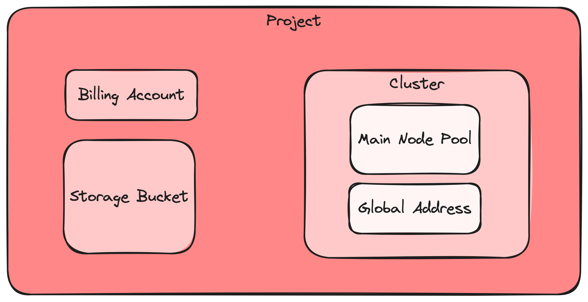

# gcp-sample
Terraform modules for a starter GCP project and cluster.



## Initialization
After initializing the project, you'll want to move the state into the bucket.

```
# backend.tf

terraform {
  backend "gcs" {
    bucket = "NAME OF YOUR BUCKET"
    prefix = "terraform/state"
  }
}
```

## Maintaining

Prerequisites:
- Login to google cloud `gcloud auth login`

Apply changes to infrastructure configuration.
```shell
make terraform-apply
```